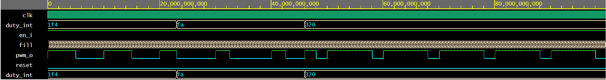

# Nexys board mono audio output and PWM sound generation

### Team members

* Šándor (responsible for VHDL testbench)
* Laban (responsible for VHDL constrains)
* Litovska (responsible for Github page)
* Nimmerrichter (responsible for VHDL architecture)

### Table of contents

* [Project objectives](#objectives)
* [Hardware description](#hardware)
* [VHDL modules description and simulations](#modules)
* [TOP module description and simulations](#top)
* [Video](#video)
* [References](#references)

<a name="objectives"></a>

## Project objectives

Our project goal is to generate basic signals and audio samples onto board Nexys A7-50T mono audio output. Pulse width modulation (PWM) must be chosen as the method of sound generation. 

Pulse Width Modulation (PWM) is a technique in which the width of a pulse is modulated keeping the time period of the wave constant. We use PWM module to generate a signal whose pulse width is proportional to the amplitude of the sample data. The PWM output signal is then integrated by a low-pass filter to remove
high frequency components, leaving only the low-frequency content. The output of the lowpass filter provides a reasonable reproduction of the original analog signal.
#### Typical PWM signal waveform


A fourth order low pass filter is composed of two cascaded second order low pass filter sections. There is no limit to the order of the filter that can be formed; as the order of the filter increases, so does its size.

<a name="hardware"></a>

## Hardware description

### Programming board Nexys A7-50T


### General Purpose I/O Devices on the Nexys A7

<a name="modules"></a>

## VHDL modules description and simulations
```
architecture Behavioral of pwm is
--Internal signals
signal fill : natural := 0;  --amount of filled time
signal cycles : integer := 0;  --amount of filled time
signal duty_int: natural;  --duty cycle converted to a comparable value

begin
	p_pwm : process(clk)
	begin
		if rising_edge(clk) then --start on rising edge
        	if (en_i = '1') then --check if the enable signal is on
				if (reset='1') then --synchronous active high reset
                	cycles <= 0;
                    fill <= 0;
        		else  -- if reset is turned off
                    if (duty_sw = '1') then
                        duty_int <= 750;
                    else
                      duty_int <= 500;
                    end if;    
                	if (cycles < to_integer(period)*5) then  --period*5 for sound (starts at 20 kHz with 1, ends at 50Hz with 4000)
                    	cycles <= cycles+1;
                    else --when desired number of periods hits
                        cycles <= 1;  
            			if (fill < duty_int) then --checks if the fill level is larger than the duty cycle
                			pwm_o <= '1'; 
                        	fill <= fill+1; 
                		elsif (fill >= 1000) then --if the period finishes, then start again
                        	fill <= 0;                        
                    	else            -- when period is continuing and the output should be off
                    	pwm_o<='0';
                        fill <= fill+1; 
                        end if;
                                            
                	end if;  
                    
            	end if;        
        	end if;
		end if;
	end process p_pwm;

end architecture Behavioral;
```

<a name="top"></a>

## TOP module description and simulations
```
entity top is
Port ( 
  CLK100MHZ : in STD_LOGIC;
  BTNC  : in std_logic;  
  SW0: in std_logic;
  SW1: in std_logic;
  AUD_PWM: out std_logic;
  SW: in std_logic_vector (11 downto 0)
  
  );
end top;

architecture Behavioral of top is

begin
pwm : entity work.pwm
        port map(
            clk   => CLK100MHZ,
            reset => BTNC,
            en_i => SW0,
            pwm_o => AUD_PWM,           
            duty_sw => SW1,
            period =>unsigned (SW)
        );
end Behavioral;
```
<a name="video"></a>

## Video

https://www.youtube.com/watch?v=g_sF2OYMYu4

<a name="references"></a>

## References

1. https://miscircuitos.com/pwm-with-zybo-in-vhdl/
2. https://digilent.com/reference/programmable-logic/nexys-a7/reference-manual
